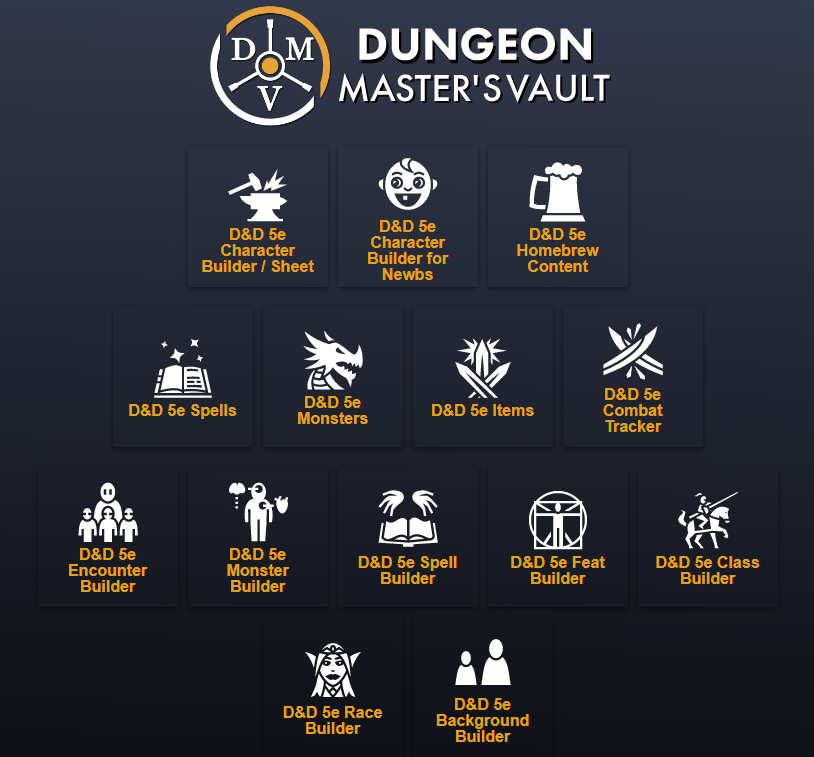

# Dungeon Master's Vault - Community Edition
<div align="center">
    <br>
    
    <br>
</div>

<div align="center">
    <h4>A web site that provides a D&D 5e Character sheet generator.</h4>


This is the code forked from OrcPub2, from the [original](https://github.com/larrychristensen/orcpub) repository on Jan 7, 2019 with improvements.

   
 

 

 


[About](#about) • [Getting Started](#getting-started) • [Development](#development) • [Contributing](#how-do-i-contribute?) • [Fundamentals](#Fundamentals)

</div>

## About
Dungeon Master's Vault is a web server that allows you to host your own Character Generator website for D&D 5th Edition.


## Getting Started

To run your own install of Dungeon Master's Vault, there are two ways to do this.  

1. Pulls docker containers from our docker repository.
2. Build your own.

In this section we will pull from the docker repository.  If you want to build your own docker containers from source, see [Development](#development)

You will need a few tools:

- git
- A system that can run docker, with docker-compose (windows or unix)
- A SSL certificate.  Self signed or from an issuing CA.
- smtp relay
- copy of this repo (for the ./deploy directory)

### Check out this branch

 Clone a copy of our repository to your machine:

 `git clone https://github.com/Orcpub/orcpub.git` if you don't have a github account

 `git clone git@github.com:Orcpub/orcpub.git` if you do
 
### Edit docker-compose.yaml

Edit the `docker-compose.yaml` and update all the environmental variables and or paths as needed.

The application configuration is environmental variables based, meaning that its behavior will change when modifying them at start time. 

To modify the variables edit the `docker-compose.yaml` or set your own in your shell/environment variables.

Example environment variables:

```shell
EMAIL_SERVER_URL: '' # DNS name of your smtp server
EMAIL_ACCESS_KEY: '' # User for the mail server
EMAIL_SECRET_KEY: '' # Password for the user
EMAIL_SERVER_PORT: 587 # Mail server port
EMAIL_FROM_ADDRESS: 'no-reply@orcpub.com' # Email address to send from
EMAIL_SSL: 'false' # Should SSL be used? Gmail requires this.
EMAIL_TLS: 'false' # Should TLS be used? 
DATOMIC_URL: datomic:free://datomic:4334/orcpub?password=yourpassword # Url for the database
ADMIN_PASSWORD: supersecretpassword #The datomic admin password (should be diffrent than the DATOMIC_PASSWORD)
DATOMIC_PASSWORD: yourpassword #The datomic application password
```

The `ADMIN_PASSWORD` and `DATOMIC_PASSWORD`

Update the `<change this>` in the `DATOMIC_URL` to match the password used in `DATOMIC_PASSWORD`.
Create an SSL certificate using `deploy/snakeoil.sh (or bat)` or simply edit the paths to an existing SSL certificate and key in the `web` service definition.

These passwords are used to secure the database server Datomic.

### Create a certificate or use an existing one

You will need a webserver certificate.  For a quick SSL certificate, the script at `./deploy/snakeoil.sh` (unix) or `./deploy/snakeoil.bat` (windows) will create self signed certificate you can use, or you can make a request to a CA and install one from there.

By default the certificate is named `snakeoil.crt` and `snakeoil.key` and used by the nginx container here:

```shell
    volumes:
      - ./deploy/nginx.conf:/etc/nginx/conf.d/default.conf
      - ./deploy/snakeoil.crt:/etc/nginx/snakeoil.crt
      - ./deploy/snakeoil.key:/etc/nginx/snakeoil.key
      - ./deploy/homebrew/:/usr/share/nginx/html/homebrew/
```

For windows you will need OpenSSL installed to run the `./deploy/snakeoil.bat`. 

OpenSSL be installed via [chocolatey](https://chocolatey.org/) `choco install openssl`

### nginx.conf

You will need the `./deploy/nginx.conf` or roll your own.

### Launch the docker containers

```shell
   docker-compose pull
   docker-compose up 
   -or-
   docker-compose up -d
```

If all went well you should be able to hit the site via `https://localhost`

If not - run the docker containers with `docker-compose up` which will show you the logs of the containers and troubleshoot from there.

### Importing your orcbrews automatically

To have your orcbrew file you want to load automatically when a new client connects, place it in the `./deploy/homebrew/homebrew.orcbrew`

All orcbrew files have to be combined into a single file named "homebrew.orcbrew".

### Character Data

**Data directory**

Character data is held in a database provided by Datomic.  Datomic stores the character and magic item information in the `./data` directory.

If you want to backup the database you only need to copy the `./data` directory after Datomic is shutdown.

If you want a new database, delete the `./data` directory to start over.

**Log directory**

The `./logs` directory contains error logs for Datomic itself and any files here can be safely removed with out affecting character data.  

Watch this directory and clean up old files, it can grow quite large quickly.

## Development

### Building your own docker images

There are three docker containers that will be built.

- orcpub_datomic_1 - the database service.
- orcpub_orcpub_1 - the JRE service that is the website.
- orcpub_web_1 - the ngnix web server that reverse proxies back to the JRE service.

**Dependencies**

- [Docker](https://docs.docker.com/install/)
- [Docker Compose](https://docs.docker.com/compose/)
- [git](https://git-scm.com/downloads)


Unix instructions [here](https://github.com/Orcpub/orcpub/wiki/Orcpub-on-Ubuntu-18.04-with-Docker)

Windows instructions [here](https://github.com/Orcpub/orcpub/wiki/Orcpub-on-Windows-10-with-Docker)

Docker Cheat [Sheet](https://github.com/Orcpub/orcpub/wiki/Docker-Cheat-sheet)


### Getting started - building the docker image from source

There are two docker-compose example files in this repository.

`docker-compose.yaml` will pull from the docker repo which the community maintains and is rebuilt with the latest code from the develop branch. **this is the default**

`docker-compose-build.yaml` is an example of how to build from the local source from a git clone. 

Rename docker-compose-build.yaml to docker-compose.yaml and it will build from your downloaded cloned directory. 

1. Start by forking this repo in your own github account and checkout the **develop** branch.   `git clone git@github.com:Orcpub/orcpub.git`
2. Create snakeoil (self-signed) ssl certificates by running `./deploy/snakeoil.sh | .bat` or modify the docker-compose.yaml to your certificates.
3. Modify the docker-compose.yaml and code you want to.
4. Run `docker-compose build` to create the new containers built from the source.
5. Run docker-compose `docker-compose up` or if you want to demonize it `docker-compose up -d`
6. The website should be accessible via browser in `https://localhost`

**NOTE**

The application configuration is Environmental Variable based, meaning that its behavior will change when modifying them at start time. To modify the variables edit the `docker-compose.yaml` or `docker-compose-build.yaml` or set your own in your shell/environment.

Example variables:

```shell
EMAIL_SERVER_URL: '' # Url to a smtp server
EMAIL_ACCESS_KEY: '' # User for the mail server
EMAIL_SECRET_KEY: '' # Password for the user
EMAIL_SERVER_PORT: 587 # Mail server port
EMAIL_FROM_ADDRESS: 'no-reply@orcpub.com' # Email address to send from
EMAIL_SSL: 'false' # Should SSL be used? Gmail requires this.
DATOMIC_URL: datomic:free://datomic:4334/orcpub?password=yourpassword # Url for the database
ADMIN_PASSWORD: supersecretpassword
DATOMIC_PASSWORD: yourpassword
```

To change the datomic passwords you can do it through the environment variables `ADMIN_PASSWORD_OLD` and `DATOMIC_PASSWORD_OLD` start the container once, then set the `ADMIN_PASSWORD` and `DATOMIC_PASSWORD` to your new passwords.

More on these passwords here.
[ADMIN_PASSWORD](https://docs.datomic.com/on-prem/configuring-embedded.html#sec-2-1)
[DATOMIC_PASSWORD](https://docs.datomic.com/on-prem/configuring-embedded.html#sec-2-1)

## How do I contribute?
Thank you for rolling for initiative!

We work on forks, and branches.  Fork our repo, then create a new branch for any bug or new feature that you want to work on.

### Get started

- Install Java: http://openjdk.java.net/ 
- or http://www.oracle.com/technetwork/java/javase/downloads/jdk8-downloads-2133151.html
- Download [Datomic](https://my.datomic.com/downloads/free/0.9.5561), and unzip it into a directory.

  Launch Datomic by going to shell/cmd prompt in the unzipped directory and run:

  On Windows:

  `bin\transactor config/samples/free-transactor-template.properties`

  On Mac/Unix:

  `bin/transactor config/samples/free-transactor-template.properties`


- Install [leiningen](https://leiningen.org/#install)
  - Mac / Linux: The latest version (2.9.1 as of this writing) should work.
  - Windows: 2.9.3 Can be installed with [chocolatey](https://chocolatey.org/install) using `choco install lein --version 2.9.3`

- Download the code from your git fork

   `git clone git@github.com:yourrepo/your.git`
 
   Use the clone url in YOUR repo.

- cd into orcpub
- create a new branch for the bug fix or feature you are about to work on `git checkout -b <your_new_branch_name>`
- Pick an editor from the next steps.
- run `lein with-profile +start-server repl`
- run `lein figwheel` Once lein figwheel finishes, a browser will launch.

You should have all three processes running: the Datomic transactor, lein repl, and lein figwheel. 

When you save changes, it will auto compile and send all changes to the browser without the
need to reload. After the compilation process is complete, you will
get a Browser Connected REPL. An easy way to try it is:

```clojure
(js/alert "Am I connected?")
```

and you should see an alert in the browser window.

Code away! and make your commits.

When your branch is ready create a pull request on our repo for a code review and merge back into our branch.


### Suggested Editors

### Emacs
Emacs with [Cider](https://cider.readthedocs.io/en/latest/) you can run the command to start the Cider REPL:

```
C-c M-j
```

### Vim
[vim-fireplace](https://github.com/tpope/vim-fireplace) provides a good way to interact with a running repl without leaving Vim.

### IntelliJ / Cursive
You can use the community edition of [IntelliJ IDEA](https://www.jetbrains.com/idea/download/) with the [Cursive plug-in](https://cursive-ide.com/).

### VS Code
You can use the open source edition of [Visual Studio Code](https://code.visualstudio.com/Download) with the Calva: Clojure & ClojureScript Interactive Programming, Clojure Code, and Bookmarks Extensions.

To start REPL with VS Code, first launch datomic in a cmd window, then jack-in using the Leiningen + Legacy Figwheel, figwheel-native, and select the :dev and optionally :start-server.

### REPL

Once you have a REPL, you can run this from within it to create the database, transact the database schema, and start the server:

You only need to `(init-database)` ONCE.

```clojure
user=> (init-database)
user=> (start-server)
```

To stop you will need to do this:

```clojure
user=> (stop-server)
```

Within Emacs you should be able to save your file (C-x C-s) and reload it into the REPL (C-c C-w) to get your server-side changes to take effect. Within Vim with `vim-fireplace` you can eval a form with `cpp`, a paragraph with `cpip`, etc; check out its help file for more information. Regardless of editor, your client-side changes will take effect immediately when you change a CLJS or CLJC file while `lein figwheel` is running.

## Fundamentals

### Overview - from the original author - Larry

The design is based around the concept of hierarchical option selections applying modifiers to a entity. 

Consider D&D 5e as an example. In D&D 5e you build and maintain characters, which are entities, by selecting from a set of character options, such as race and class. When you select a race you will be afforded other option selections, such as subrace or subclass. 

Option selections also apply modifiers to your character, such as 'Darkvision 60'. Option selections are defined in templates. An entity is really just a record of hierarchical choices made. 

A built entity is a collection of derived attributes and functions derived from applying all of the modifiers of all the choices made. Here is some pseudocode to this more concrete:

```clojure
user> (def character-entity {:options {:race
                                       {:key :elf,
                                        :options {:subrace {:key :high-elf}}}}})
                                          
user> (def template {:selections [{:key :race
                                   :min 1
                                   :max 1
                                   :options [{:name "Elf"
                                              :key :elf
                                              :modifiers [(modifier ?dex-bonus (+ ?dex-bonus 2))
                                                          (modifier ?race "Elf")]
                                              :selections [{:key :subrace
                                                            :min 1
                                                            :max 1
                                                            :options [{:name "High Elf"
                                                                       :key :high-elf
                                                                       :modifiers [(modifier ?subrace "High Elf")
                                                                                   (modifier ?int-bonus (+ ?int-bonus 1))]}]}]}]}]}
                                                                 
user> (def built-character (build-entity charater-entity template))

user> built-character
{:race "Elf"
 :subrace "High Elf"
 :dex-bonus 2
 :int-bonus 1}
```

This may seem overly complicated, but after my work on the Original Orcpub.com, I realized that this really the only real correct solution as it models how character building actually works. 

The original Orcpub stored characters essentially like the built-character above with a centralized set of functions to compute other derived values. This is the most straightforward solution, but this has flaws:

* You have difficulty figuring out which options have been selected and which ones still need to be selected.
* You keep having to patch your data as your application evolves. For example, say you store a character's known spells as a list of spell IDs. Then you realize later that users want to also know what their attack bonus is for each spell. At the very least you'll have to make some significant changes to every stored character.
* It is not scalable. Every time you add in more options, say from some new sourcebook, you have to pile on more conditional logic in your derived attribute functions. Believe me, this gets unmanageable very quickly.
* It's not reusable in, say, a Rifts character builder.

The architecture fixes these problems:

* You know exactly which options have been selected, which have not, and how every modifier is arrived at, given the entity and the most up-to-date templates.
* You don't need to patch up stored characters if you find a bug since characters are stored as just a set of very generic choices.
* It's scalable and pluggable. Most logic for derived values is stored inside of the options that create or modify these derived values. Many rules within D&D 5e allow for picking the best of alternate calculations for a particular attribute (AC comes to mind). With the OrcPub2 solution you can have an option easily override or modify a calculation without any other code having to know about it. This makes for a MUCH more manageable solution and makes it easy to add options as plugins. 
* The entity builder engine could be used for building any character in any system. In fact, it could be used to build any entity in any system. For example, say you have a game system with well-defined mechanics building a vehicle, the entity builder engine could do that.

### Modifiers

Character modifiers are tough to get right. As mentioned above, the naive approach is to try to centralize all logic for a calculation in one place. For example you might have a character that looks like this:

```clojure
{:race "Elf"
 :subrace "High Elf"
 :base-abilities {:int 12
                  :dex 13}}
```

Given this, you might start calculating initiative as follows:

```clojure
(defn ability-modifier [value] ...)

(defn race-dexterity [character]
  (case (:race character)
    "Elf" 2
    ...))
    
(defn subrace-dexterity [character] ...)

(defn base-ability [character ability-key]
  (get-in character [:base-abilities ability-key]))

(defn dexterity [character]
  (+ (base-ability character :dex)
     (race-dexterity character)
     (subrace-dexterity character)))
     
(defn initiative [character]
   (ability-modifier (dexterity character)))
```

Consider what happens when you need to account for the 'Improved Initiative' feat, you'll need to add the calculation to the initiative function. Okay, this is probably still manageable. 

Then consider what happens when some cool subclass comes along that gets an initiative bonus at 9th level. Now it starts getting more unmanageable. When you try to add every option from every book into the mix, each of which might have some totally new condition for modifying initiative, you quickly end up with a nauseating ball of mud that will be scary to work with.

This method decentralizes most calculations using modifiers associated with selected character options. When you add options you also specify any modifiers associated with that option. 

For example, in the entity example above, we have the elf option:

```clojure
{:name "Elf"
  :key :elf
  :modifiers [(modifier ?dex-bonus (+ ?dex-bonus 2))
              (modifier ?race "Elf")]
  ...}
```

If you build a character that has this :elf option selected, the modifiers will be applied the the :dex-bonus and :race in the built character. Let's look closer at the ?dex-bonus modifier. 

The second argument to the modifier function is a special symbol that prefixes a ? on the attribute instead of the : we'll expect on the output attribute key, in this case ?dex-bonus will be modifying the value output to the :dex-bonus attribute. 

The third argument is a modifier body. 

This can be any Clojure expression you like, but if you will be deriving your new value from an old value or from another attribute you must use the ?<attribute-name> reference. In this example we updating ?dex-bonus by adding 2 to it. 

Modifiers can be derived from attributes that are derived from other attributes, and so forth.

For example, we may have a character whose options provide the following chain of modifiers:

```clojure
(modifier ?dexterity 12)
(modifier ?intelligence 15)
(modifier ?dex-mod (ability-mod ?dexterity))
(modifier ?int-mod (ability-mod ?intelligence))
(modifier ?initiative ?dex-mod)
(modifier ?initiative (+ ?initiative (* 2 ?intelligence-mod)))
```

### Modifier Order is Important!

Consider what would happen if we applied the above modifiers in a different order:

```clojure
(modifier ?initiative (+ ?initiative (* 2 ?int-mod)))
(modifier ?dexterity 12)
(modifier ?intelligence 15)
(modifier ?dex-mod (ability-mod ?dexterity))
(modifier ?int-mod (ability-mod ?intelligence))
(modifier ?initiative ?dex-mod)
```
Either our initiative calculation would throw an error our it would be completely wrong since the other derived attributes it depends on have not been applied yet. There is no logical ordering for which options should be applied, so modifiers can very well be provided out of order. 

For this reason we have to build a dependency graph of derived attributes and then apply the modifiers in topologically sorted order. Identifying these dependencies is why we use the ?<attribute-name> references. 

## FAQs
**Q: I'm a newb Clojure developer looking to get my feet wet, where to start?**

**A:** *First I would start by getting the fundamentals down at http://www.4clojure.com/ From there you might add some unit tests or pick up an open issue on the "Issues" tab (and add unit tests with it).*


**Q: Your DSL for defining character options is pretty cool, I can build any type of character option out there. How about I add a bunch on content from the Player's Handbook?**

**A:** *We love your enthusiasm, but we cannot accept pull requests containing copyrighted content. We do, however, encourage you to fork us and create your own private version with the full content options.*

## Disclaimer

The use of this tool is meant for use for your own use and your own content. It is only meant and should only be used on campaigns with content that you legally possess. This tool is not affiliated with Roll20, or Wizards of the Coast.

## Credits
Larry Christensen original author of [Orcpub2](https://github.com/larrychristensen/orcpub)

## License
[EPL-2.0](LICENSE)
